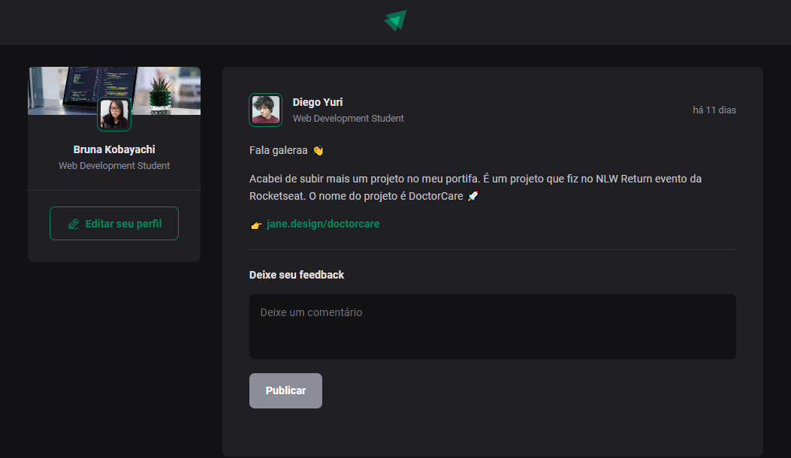
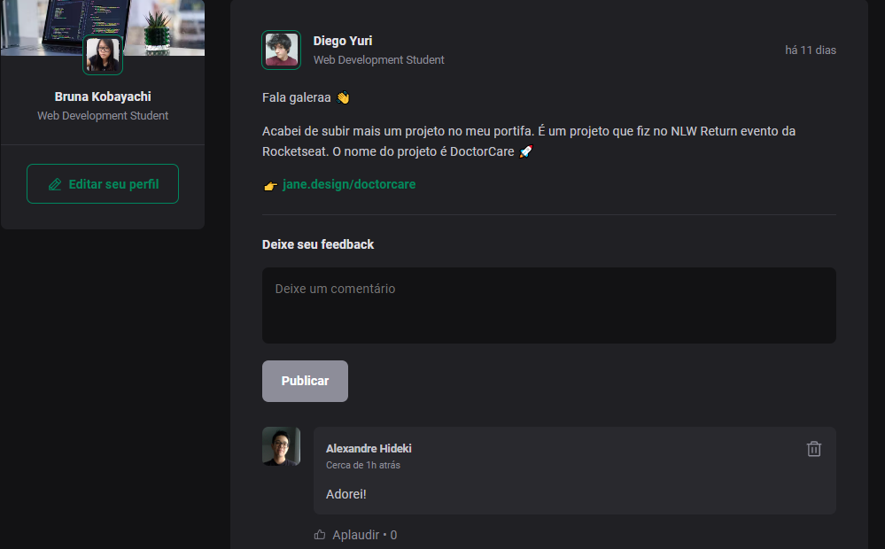

# ignite-feed
# About
Ignite feed was developed at Rocketseat's React.js basics course, it is a simple social media where you can comment, delete and aplaud ("Aplaudir" button) to interact at the application!
<p align="center">  </p> 
<p align="center">  </p> 

# Techs
- TypeScript
- React
- Vite
- CSS

# Test
Clone this repo. and install all needed dependencies

```bash
npm install
```
Then run 
```bash
npm run dev
```
And enjoy!

